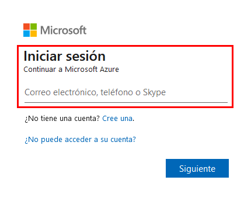
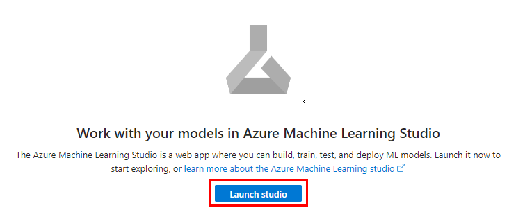

# **Laboratorio 1.1. Configuración del Entorno de Desarrollo en Azure**

## **Objetivo de la práctica:**
Al finalizar la práctica, serás capaz de:
- Configurar un nuevo proyecto en Azure Machine Learning Studio.
- Preparar el entorno para un modelo.

## **Objetivo Visual**
Se realizará la creación de un Workspace de Azure Machine Learning Studio y se dará de alta una libreta de Jupyter para la validación del ambiente.

## **Duración aproximada:**
- 50 minutos.

## **Prerequisitos:**
- Tener una cuenta activa en Azure.
- Acceso a Azure Machine Learning Studio (puedes obtener una prueba gratuita si es necesario).

## **Instrucciones**

### **Tarea 1. Acceso al Portal de Azure**

> En esta tarea se realizará la autenticación en el portal de Azure.

1. Abre tu navegador web (de preferencia **Google Chrome**).

2. Navega a la página principal de Azure Portal: [Azure Portal](https://portal.azure.com/).

3. Si ya tienes una cuenta de Azure, ingresa tu **dirección de correo electrónico y contraseña asociada** a tu cuenta de Azure.

4. Si aún no tienes una cuenta, haz clic en **"Cree una"** y sigue las instrucciones para crear una cuenta de Azure. Necesitarás una tarjeta de crédito para la verificación, pero **no se te cobrará** durante el período de prueba.

5. Es posible que se te solicite realizar una verificación de seguridad adicional, como un código enviado a tu correo electrónico o teléfono. Sigue las instrucciones en pantalla para completar este proceso.

6. Una vez iniciada sesión o creada tu cuenta, accederás a la interfaz del portal de Azure.

> **¡TAREA FINALIZADA!**

### **Tarea 2. Creación de Azure Machine Learning Studio**

> En esta tarea se creará el ambiente de Azure Machine Learning Studio para el entrenamiento e implementación.

1. Ahora, en la parte superior central del portal, haz clic en el buscador y escribe lo siguiente: **`Azure Machine Learning`**.

2. Selecciona el servicio como lo muestra la imagen.

3. Dentro de la **interfaz de Azure Machine Learning**, haz clic en el botón **+ Create** y selecciona la opción **New Workspace**. Puedes guiarte con la siguiente imagen.

4. Ahora realizaremos la configuración mínima válida para el workspace y laboratorio.

| Parámetro       | Valores |
|-----------------|---------|
| Subscription    | Selecciona la **suscripción** de tu cuenta o la que se asignó para el curso. |
| Resource Group  | Crea uno nuevo con el nombre **mlrg**. |
| Name            | **mldata-workspace** |
| Region          | **East US** |

> [!IMPORTANT]
> **El resto de los valores se quedarán por defecto.**

5. Ahora haz clic en el botón inferior izquierdo llamado **Review + create**. Esto iniciará un proceso de validación de la configuración definida.

6. Finalmente, haz clic en el botón **Create**.

> [!NOTE]
> El proceso de creación puede durar de **1.30 minutos a 2 minutos** aproximadamente.

7. Una vez creado, haz clic en el botón **Go to resource**.

8. Dentro de la página principal de **Azure Machine Learning Workspace**, haz clic en el botón **Launch studio**.

9. Ahora estarás dentro de la página principal de **Machine Learning Studio**. Puedes explorar algunas opciones como las de la tabla siguiente.

| Parámetro       | Valores |
|-----------------|---------|
| Data            | Para gestionar y explorar los datos que usarás en tus experimentos. |
| Jobs            | Donde puedes crear y ejecutar tus experimentos de Machine Learning. |
| Components      | Registra tu código desde GitHub, AzureDevOps o archivos locales para crear componentes compartibles. |
| Pipelines       | Para crear y gestionar flujos de trabajo de Machine Learning. |
| Environments    | Los entornos curados son entornos predefinidos que ofrecen buenos puntos de partida para construir tus propios entornos. |
| Models          | Para ver y gestionar los modelos que has entrenado. |
| Endpoints       | Los puntos finales en tiempo real contienen implementaciones que están listas para recibir datos de clientes y pueden enviar respuestas de inmediato. |

> **¡TAREA FINALIZADA!**

### **Tarea 3. Implementación de un modelo de entrenamiento**

> En esta tarea se entrenará e implementará un modelo para validar que el entorno de **Machine Learning Studio** haya sido creado correctamente.

1. Dentro de la página principal del Studio de ML, selecciona la libreta de ejemplo llamada **Get Started: Train and deploy a model** y haz clic en el botón **Start**.

2. Una vez abierta la libreta, haz clic en el botón **Clone this notebook** para agregarla a tu workspace.

3. Se abrirá una ventana emergente donde confirmarás la clonación dando clic en el botón **Clone**.

> [!NOTE]
> El proceso de clonación puede durar **30 a 50 segundos** aproximadamente.

4. Ya clonado el proyecto, verás en la parte izquierda el árbol de archivos para el entrenamiento.

5. En la parte central verás el título de la libreta llamada **First look at Azure Machine Learning**.

6. A partir de este momento, el **resto del laboratorio** lo realizarás con las **instrucciones de la libreta** en el Estudio de Azure ML.

> [!IMPORTANT]
> Tips para algunos pasos en la libreta.

7. En la creación de la **Máquina Virtual de Cómputo**, cambiarás los siguientes valores:

| Parámetro       | Valores |
|-----------------|---------|
| Compute Name    | **mlcompute-sXXXX** Cambia las **"X"** por 4 dígitos aleatorios. |
| Virtual Machine Size | **Standard_DS11_v2** |

8. Ahora, da clic en la opción **Scheduling** para ajustar el tiempo de inactividad de la Máquina de Cómputo a **15 minutos** y haz clic en el botón **Review + create**.

> El resto de las configuraciones se quedarán por defecto.

9. Finalmente, haz clic en el botón **Create** de la sección **Review**.

> [!NOTE]
> El tiempo aproximado de creación es de **2.20 - 2.30 minutos**. Espera a que esté en el estado **Running** antes de continuar.

> [!IMPORTANT]
> En la sección **Submit the job** puede tardar **3 minutos** en iniciar el Job, y en completar puede tardar **2.50 minutos** aproximadamente.

> [!IMPORTANT]
> En la sección **Create a new online endpoint** puede tardar **2 minutos** en crear el endpoint aproximadamente.

> [!WARNING]
> Si te marca un error **`(SubscriptionNotRegistered) Resource provider [N/A] isn't registered with Subscription [N/A]`** registra el Resource Provider en la suscripción llamado **`Microsoft.Cdn`**

> [!IMPORTANT]
> En la sección **Deploy the model to the endpoint** puede tardar **6 a 8 minutos** para realizar la implementación.

> [!WARNING]
> En caso de que te marque un error por el tipo de la máquina virtual, puedes cambiar el valor de la **línea 12** y usar este tipo: **Standard_DS1_v2**. Al ser un servidor más pequeño, el tiempo de implementación puede ser de **9.30 a 10 minutos**.

> [!CAUTION]
> **No olvides eliminar el endpoint al final de la libreta.**

> **¡TAREA FINALIZADA!**

### Resultado esperado
El resultado debe ser la ejecución de todas las celdas sin errores.

> **¡LABORATORIO FINALIZADO!**