# Laboratorio 2. Implementación de CI/CD para Machine Learning.

## Objetivo de la práctica:
Al finalizar la práctica, serás capaz de:
- Configurar un pipeline de CI/CD en Azure DevOps para un proyecto de Machine Learning.

## Objetivo Visual:

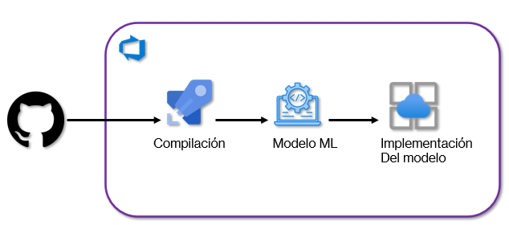

## Duración aproximada:
- 60 minutos.

## **Prerrequisitos:**
- Cuenta de Azure.
- Cuenta de GitHub.
- Proyecto de Machine Learning existente en GitHub (usaremos un dataset de predicción de precios de casas).
- Familiaridad básica con Azure DevOps.

## Instrucciones:

### Tarea 1. Configuración del Proyecto en Azure DevOps.

1.  Inicia sesión en **[Azure DevOps](https://dev.azure.com/)**.

2.  Clic en el botón **`Start free`**.

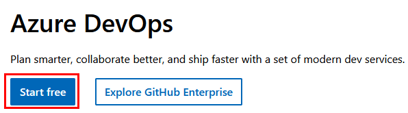

3. Autentícate con la cuenta de **Azure/Microsoft**.

> [!NOTE]
> Si es la primera vez que usas tu cuenta, continúa con los pasos de autenticación y creación de la organización de **Azure DevOps**.

4.  Una vez autenticado, crea el proyecto de la organización de Azure DevOps con el siguiente nombre: **```mlopsproject```**.

5.  Da clic en el botón **`Create project`**.

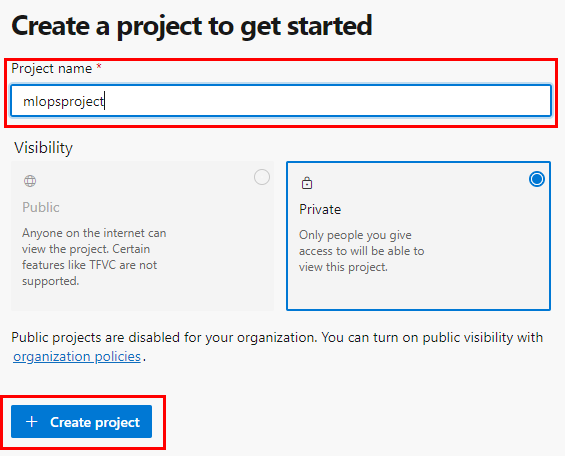

> [!NOTE]
> En caso de que ya tengas proyectos existentes, puedes dar clic en el botón de la esquina superior derecha llamado **`New Project`**.

6.  Abre otra pestaña en tu navegador e inicia sesión en **[GitHub](https://github.com/)**.

> [!NOTE]
> Puedes usar una cuenta ya existente o crear una.

7.  Dentro de tu cuenta de **GitHub** crea un nuevo repositorio.

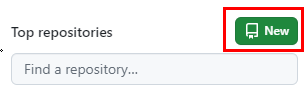

8.  En la pantalla **`Create a new repository`**, configura lo siguiente:

| Parámetro       | Valores |
|-----------------|---------|
| Repository name    | **```mlopsrepo```** Si está ocupado el nombre, puedes agregar letras o números.|
| Private  | **Seleccionado**. |
| Add a README file  | **Seleccionado**. |

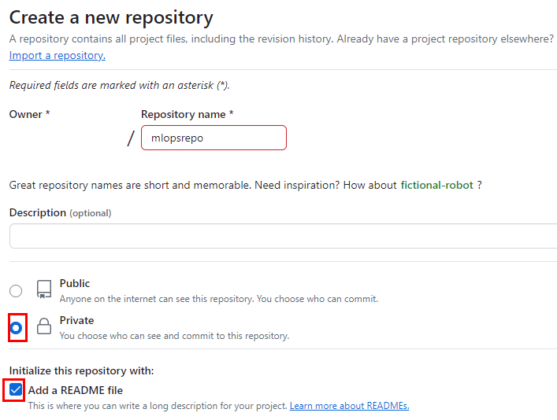

9.  Clic en el botón **`Create repository`**. 

10. Da clic en el botón **`Add file`** y después en **`Create new file`**.


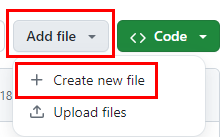

11. Agrega el siguiente código al archivo:

```
scikit-learn==1.3.0
pandas==2.1.1
numpy==1.24.0
joblib==1.3.2
pytest==7.4.0
```

> [!IMPORTANT]
> Este archivo realizará la instalación de las dependencias que necesita el programa de entrenamiento del modelo para generarlo.

12. Escribe el siguiente nombre del archivo: **```requirements.txt```**.

13. Da clic en el botón lateral derecho color verde llamado **`Commit changes`**.

14. Nuevamente, haz clic en **`Commit changes`** de la ventana emergente.

15. Ahora repite los pasos anteriores, del ***10 al 14***, pero agrega el siguiente código en el archivo:

```
import pandas as pd
import numpy as np
from sklearn.datasets import fetch_california_housing
from sklearn.model_selection import train_test_split
from sklearn.linear_model import LinearRegression
from sklearn.metrics import mean_squared_error, r2_score
import joblib
import os

# Función para cargar los datos
def load_data():
    try:
        housing = fetch_california_housing()
        X = pd.DataFrame(housing.data, columns=housing.feature_names)
        y = pd.Series(housing.target, name='MedHouseVal')
        return X, y
    except Exception as e:
        print(f"Error al cargar los datos: {e}")
        raise

# Validar la integridad de los datos
def validate_data(X, y):
    assert X.isnull().sum().sum() == 0, "Los datos contienen valores nulos"
    assert len(X) == len(y), "El número de muestras y etiquetas no coincide"
    assert X.shape[1] == 8, f"Se esperaban 8 características, pero se encontraron {X.shape[1]}"

# Función para dividir los datos
def split_data(X, y):
    try:
        X_train, X_test, y_train, y_test = train_test_split(X, y, test_size=0.2, random_state=42)
        return X_train, X_test, y_train, y_test
    except Exception as e:
        print(f"Error al dividir los datos: {e}")
        raise

# Función para entrenar el modelo
def train_model(X_train, y_train):
    try:
        model = LinearRegression()
        model.fit(X_train, y_train)
        return model
    except Exception as e:
        print(f"Error al entrenar el modelo: {e}")
        raise

# Función para evaluar el modelo
def evaluate_model(model, X_test, y_test):
    try:
        y_pred = model.predict(X_test)
        mse = mean_squared_error(y_test, y_pred)
        r2 = r2_score(y_test, y_pred)
        print(f"Mean Squared Error: {mse}")
        print(f"R^2 Score: {r2}")
        assert mse < 1.0, "El MSE es demasiado alto, considera mejorar el modelo"
        assert r2 > 0.5, "El R^2 Score es bajo, considera mejorar el modelo"
    except Exception as e:
        print(f"Error al evaluar el modelo: {e}")
        raise

# Función para guardar el modelo
def save_model(model, filepath='model.pkl'):
    try:
        joblib.dump(model, filepath)
        assert os.path.exists(filepath), f"No se pudo guardar el modelo en {filepath}"
        print(f"Modelo guardado exitosamente en {filepath}")
    except Exception as e:
        print(f"Error al guardar el modelo: {e}")
        raise

# Flujo principal
if __name__ == "__main__":
    try:
        # Cargar y validar los datos
        X, y = load_data()
        validate_data(X, y)

        # Dividir los datos
        X_train, X_test, y_train, y_test = split_data(X, y)

        # Entrenar el modelo
        model = train_model(X_train, y_train)

        # Evaluar el modelo
        evaluate_model(model, X_test, y_test)

        # Guardar el modelo
        save_model(model)

    except Exception as e:
        print(f"Fallo en el proceso de entrenamiento: {e}")
```

16. Escribe el siguiente nombre para el archivo: **```train.py```**.

> [!IMPORTANT]
> El archivo **`train.py`** carga el dataset de California Housing (demostrativo), valida los datos para asegurarse de que no contengan errores, divide los datos en conjuntos de entrenamiento y prueba, entrena un modelo de regresión lineal, evalúa su rendimiento mediante el cálculo del MSE y el R², y finalmente guarda el modelo entrenado en un archivo model.pkl.

17. Agrega un archivo más al repositorio y pega el siguiente código:

```
import pytest
import joblib
import numpy as np

# Prueba para verificar la carga del modelo
def test_model_loading():
    model = joblib.load('model.pkl')
    assert model is not None, "El modelo no se cargó correctamente"

# Prueba para realizar una predicción de prueba
def test_model_prediction():
    model = joblib.load('model.pkl')
    
    # Datos de prueba simples
    test_data = np.array([8.3252, 41.0, 6.984127, 1.023809, 322.0, 2.555556, 37.88, -122.23]).reshape(1, -1)
    
    # Realizar predicción
    prediction = model.predict(test_data)
    
    # Validaciones básicas
    assert prediction is not None, "La predicción falló"
    assert prediction.shape == (1,), "La predicción debe ser un array unidimensional"
    assert isinstance(prediction[0], (int, float)), "La predicción debe ser un número"

# Prueba para verificar que el modelo es consistente (reproduce los mismos resultados)
def test_model_consistency():
    model = joblib.load('model.pkl')
    
    # Datos de prueba simples
    test_data = np.array([8.3252, 41.0, 6.984127, 1.023809, 322.0, 2.555556, 37.88, -122.23]).reshape(1, -1)

    # Realizar predicciones múltiples veces
    prediction_1 = model.predict(test_data)
    prediction_2 = model.predict(test_data)

    # Las predicciones deben ser idénticas
    assert np.array_equal(prediction_1, prediction_2), "El modelo debe producir predicciones consistentes"

# Prueba básica para verificar que el modelo no produce valores extremadamente altos o bajos
def test_model_output_range():
    model = joblib.load('model.pkl')
    
    # Datos de prueba simples
    test_data = np.array([8.3252, 41.0, 6.984127, 1.023809, 322.0, 2.555556, 37.88, -122.23]).reshape(1, -1)

    # Realizar predicción
    prediction = model.predict(test_data)

    # Verificar que la predicción está en un rango esperado (ajusta este rango según tu caso)
    assert 0.0 <= prediction[0] <= 10.0, f"La predicción está fuera del rango esperado: {prediction[0]}"
```

18. Escribe el siguiente nombre para el archivo: **```tests/test_model.py```**.

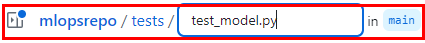

> [!IMPORTANT]
> El archivo **`test_model.py`** realiza pruebas unitarias para verificar que el modelo entrenado se cargue correctamente, haga predicciones consistentes, tenga un rendimiento aceptable (evaluado mediante MSE), y supere a un modelo base simple.

19. Guarda el archivo.

20. La estructura raíz de los archivos debe de ser como en la imagen siguiente:

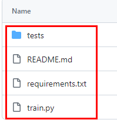

21. Posteriormente, da clic en el botón lateral izquierdo llamado **`<> Code`**.

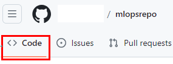

22. Haz clic en el botón verde **`Code`** para desplegar el menú; verifica que esté seleccionado **`HTTPS`** y copia a la URL del repositorio, como lo muestra la imagen.

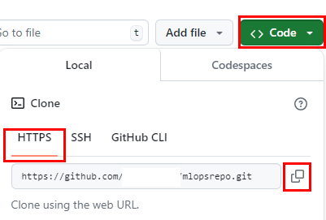

> [!NOTE]
> Guarda la URL momentáneamente en tu Bloc de Notas.

23. Regresa a la página de **[Azure DevOps](https://dev.azure.com/)**.

24. Da clic en el nombre de tu proyecto y, en el menú lateral izquierdo, selecciona **`Repos`**.

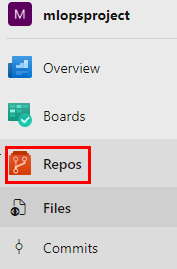

25. Ahora, haz clic en la opción **`Import a repository`**.

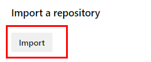

26. Pega la URL que tienes en el Bloc de notas y da clic en **`Import`**.

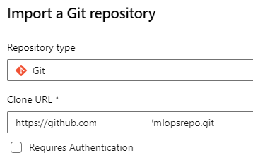

> [!NOTE]
> Espera de **10 a 20 segundos**; automáticamente te redireccionará al repositorio importado.

27. Asegúrate de que estén todos los archivos.

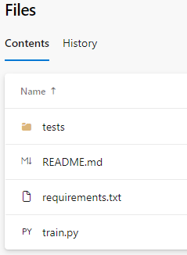

> **¡TAREA FINALIZADA!**

### Tarea 2. Configuración del Pipeline de Integración Continua (CI).

1.  Dentro del proyecto **`mlopsproject`**, selecciona del menú lateral izquierdo **Pipelines**.

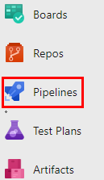

2.  Clic en el botón **`Create Pipeline`**.

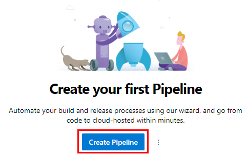

3.  En la opción **`Where is your code?`**, selecciona **`GitHub`**.

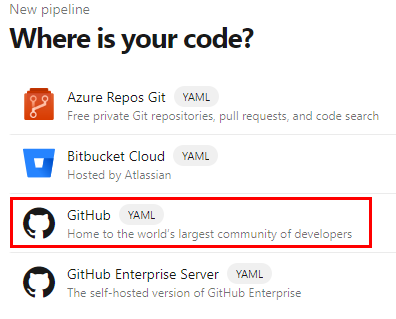

4.  Esto abrirá una página para que brindes la autorización de integración entre **GitHub** y **Azure Pipelines**. Da clic en el botón **`Authorize AzurePipelines`**.

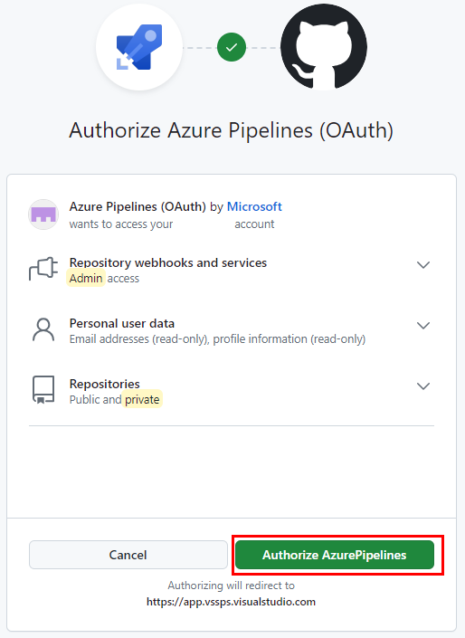

5.  Una vez autorizado, selecciona el repositorio llamado **mlopsrepo**, el cual fue previamente creado.


6.  En la opción **`Configure your pipeline`**, selecciona **`Starter pipeline`**.

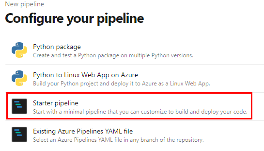

7.  Ahora borra todo el contenido del archivo YAML existente y pega el siguiente código:

```
trigger:
  branches:
    include:
    - main

pool:
  vmImage: 'ubuntu-latest'

steps:
- task: UsePythonVersion@0
  inputs:
    versionSpec: '3.x'
    addToPath: true

# Paso para instalar distutils y dependencias
- script: |
    udo apt-get update
    sudo apt-get install -y python3-distutils
    python -m pip install --upgrade pip setuptools wheel
    pip install -r requirements.txt
  displayName: 'Instalar dependencias y distutils'

# Paso para ejecutar el entrenamiento del modelo
- script: |
    python train.py
  displayName: 'Entrenar el modelo'

# Paso para ejecutar las pruebas unitarias
- script: |
    python -m pytest tests/
  displayName: 'Ejecutar pruebas unitarias'
```

> [!NOTE]
> El archivo **`azure-pipelines.yml`** ejecutará los archivos del repositorio en el orden adecuado para instalar las dependencias, entrenar el modelo ejemplo y realizar las preuebas de la carpeta tests.

8.  Da clic en el botón lateral derecho **`Save and run`**.

9.  En la ventana emergente acepta la configuración predeterminada y da clic en el botón **`Save and run`**.

10. Si todo sale bien, observarás un **Job** en ejecución como lo muestra la imagen.

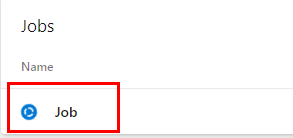

11. Puedes darle clic en el Job para que abra la ventana de detalles sobre la compilación.

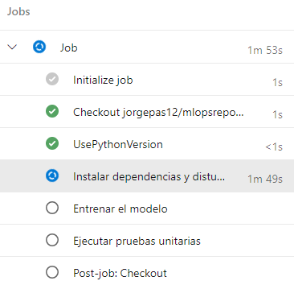

> [!NOTE]
> La compilación del Azure Pipelines puede durar entre ***40 a 60 segundos***.

12. Verifica que la compilación haya sido exitosa.

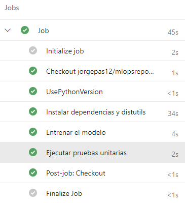

> **¡TAREA FINALIZADA!**

### Tarea 3. Configuración del Pipeline de Despliegue Continuo (CD).

1.  En **Azure DevOps**, navega a **Pipelines** > **Releases** en el menú lateral izquierdo.

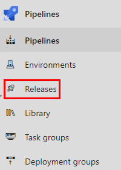

2.  Haz clic en **`New Pipeline`**.

3.  Selecciona **Empty job** al final de lista de la ventana emergente lateral izquierda y da clic en **`Apply`**.

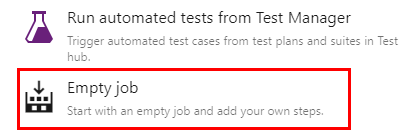

4.  En la ventana de nombre **Stage**, da clic en la cruz para cerrarla.

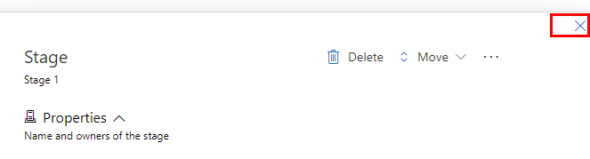

5.  Ahora, en la parte superior, cambia el nombre del pipeline escribe: **```Deploy Model```**.

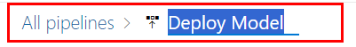

6.  En la sección de **Artifacts**, haz clic en **Add**. 

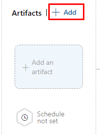

7.  Selecciona el pipeline de CI configurado previamente como fuente; puedes apoyarte de la imagen.

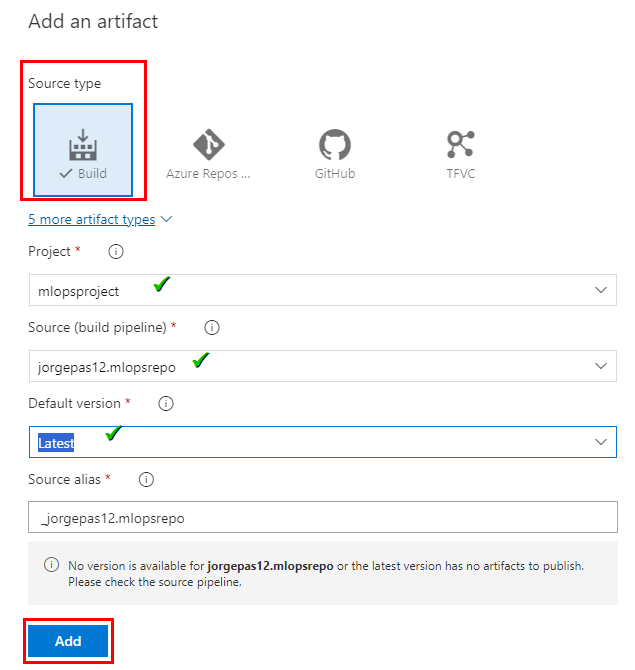

8.  Da clic en el nombre de la etapa y dentro de las propiedades haz clic en el botón **`Delete`**.

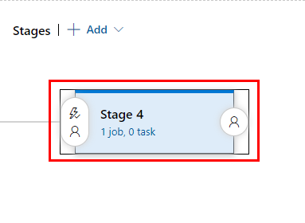

9.  Haz clic en el botón **`Add`** para agregar una nueva etapa de tipo **Azure App Service deployment**.

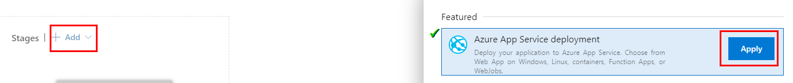

10. Cambia el nombre de la etapa escribe: **`Deploy ML`**.

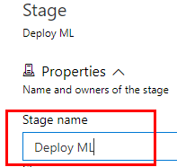

11. Haz clic en las propiedades de la etapa para terminar de configurar el servicio de **Azure Apps**

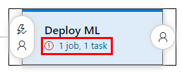

12. Da clic en el menú desplegable de la opción **Azure Subscription** y selecciona la suscripción disponible, haz clic en el botón **Authorize**.

> [!NOTE]
> Recuerda que la suscripción puede ser diferente. Continúa con el proceso si te pide autenticación para autorizarla.

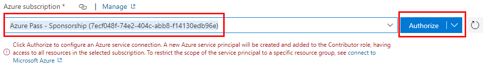

> [!IMPORTANT]
> **NO** cierres la página.

13. Abre otra pestaña en tu navegador y da clic en la página del portal de Azure **[AQUÍ](https://portal.azure.com/)**.

14. En el buscador superior de la página, escribe: **`App Services`**.

15. En la parte superior izquierda da clic en **`Create`** y en el menú desplegable selecciona **`Web App`**.

16. Define los siguientes parametros el resto se quedara por defecto:

| Parámetro       | Valores |
|-----------------|---------|
| Subscription    | Selecciona la **suscripción** de tu cuenta o la que se asignó para el curso. |
| Resource Group  | Selecciona el grupo existente **mlrg**. |
| Name            | **mlappXXXX**. Sustituye las **"X"** por valores aleatorios. |
| Publish          | **Container** |
| Operating System          | **Linux** |
| Region          | **East US** |
| Pricing plan          | **Basic B1** `Exploring pricing plans` |

17. En la parte inferior da clic en el botón **`Review + create`** y nuevamente en **`Create`**.

> [!NOTE]
> Espera el tiempo de creación del recurso, esto podría tardar **30 segundos** aproximadamente.

18. Una vez creado, regresa a la pestaña donde estabas configurando tu pipeline y configura lo siguiente:

| Parámetro       | Valores |
|-----------------|---------|
| App Type          | **Web App for Containers (Linux)** |
| App service name          | **mlappXXX** **`Nombre de tu Web App`** |
| Registry or Namespace     | **mlrgazrepoXX**. Sustituye las **"X"** por valores aleatorios. |
| Repository          | **mlrepoXXX**. Sustituye las **"X"** por valores aleatorios. |

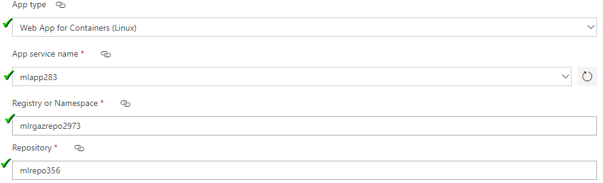

19. En la parte superior derecha haz clic en el botón **`Save`** y **`OK`** en la ventana emergente.

20. Finalmente, haz clic en el botón **`Create release`**, en la ventana emergente ejecuta **`Create`** y monitorea tus resultados.

21. Verifica tus resultados; el promedio de tiempo de implementación es **2.30 minutos**.

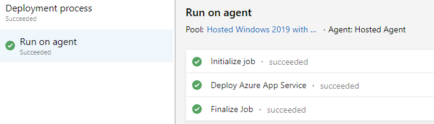

> **¡TAREA FINALIZADA!**

### Resultado esperado:
El laboratorio mostró los pasos para configurar pipelines de CI/CD en Azure DevOps, integrados con GitHub, específicamente para un proyecto de predicción de precios de casas como ejemplo.

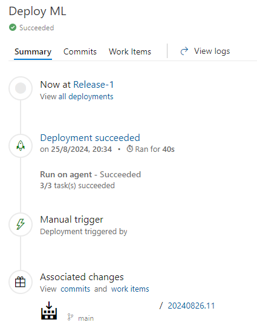

> **¡LABORATORIO FINALIZADO!**
