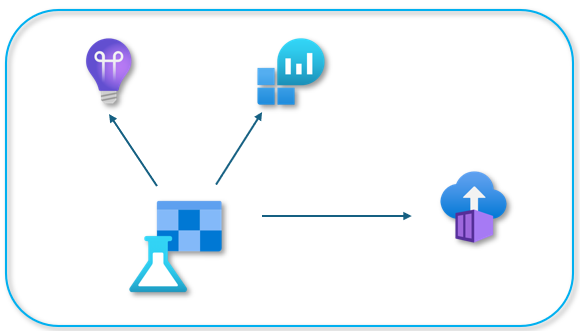
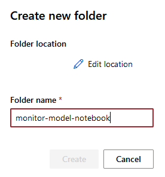
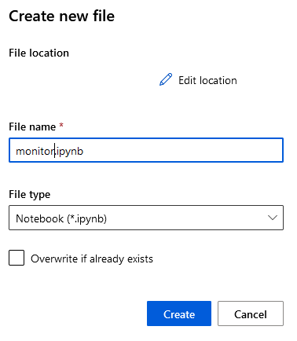
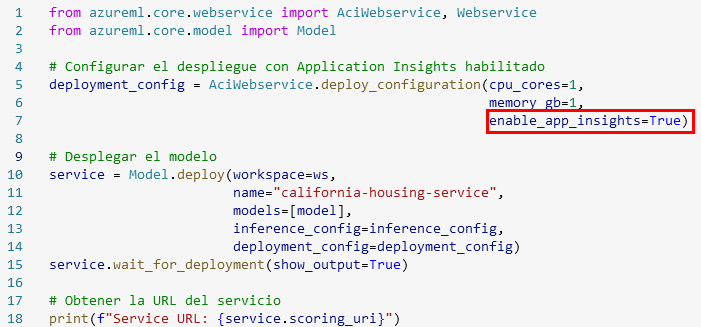
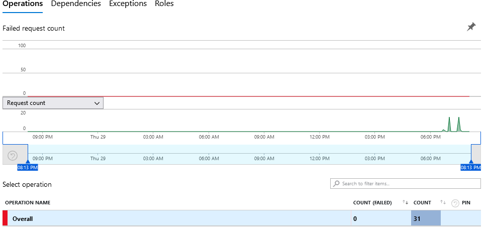
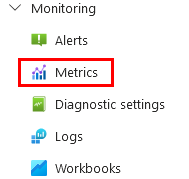
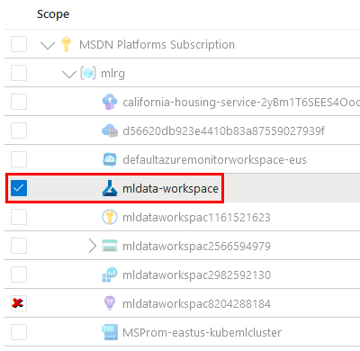
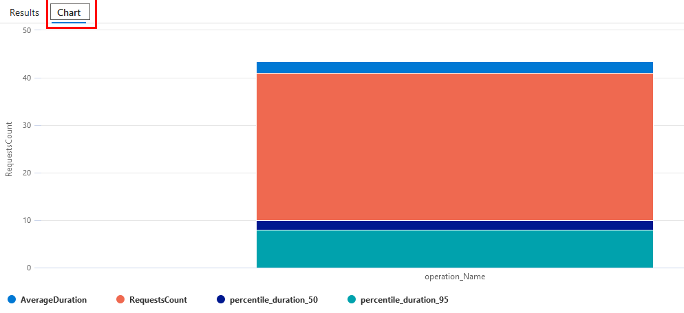
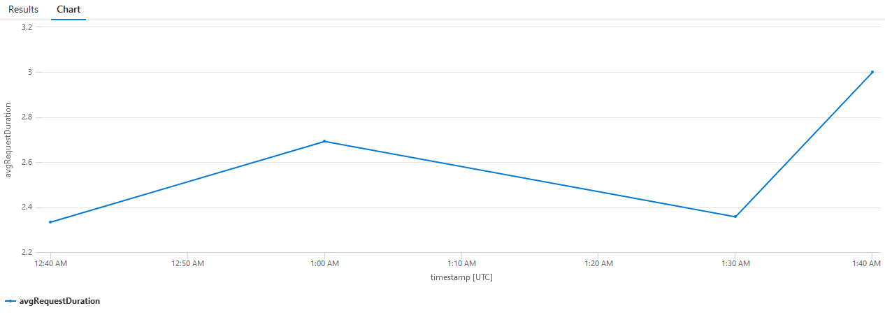

# Laboratorio 3.2. Despliegue, Monitoreo y Evaluación de Modelos.

## Objetivo de la práctica:
Al finalizar la práctica, serás capaz de:
- Implementar un modelo simulado en ambiente productivo.
- Configurar el Monitoreo de Métricas.
- Monitorear el Rendimiento del Modelo.

## Objetivo Visual:



## Duración aproximada:
- 105 minutos.

## **Prerrequisitos:**
- Una suscripción a Azure.
- Conocimientos básicos de Python y Machine Learning.
- Conocimiento básico de Azure Monitor y Application Insights.

## Instrucciones:

### Tarea 1. Configuración del Entorno en Azure Machine Learning.

En este paso, configura tu entorno de trabajo para monitorear y evaluar modelos en producción. Enfócate en instalar las librerías necesarias en un cuaderno Jupyter.

1. Dirígete al Portal de Azure e inicia sesión con tu cuenta en [Azure Portal](https://portal.azure.com/).

2. En la barra de búsqueda del portal, escribe **`Machine Learning`** y selecciona **`Machine Learning`**.

3. Usa el **Workspace** de Azure Machine Learning **existente**, el cual ha sido creado previamente.

4. Haz clic en **`Launch Studio`**.

5. Dentro de tu workspace, selecciona **`Notebooks`** del menú lateral izquierdo.


6. En tu carpeta **raíz**, haz clic en los tres puntos para expandir el menú y selecciona **`Create new folder`**.


7. Escribe el siguiente nombre: **`monitor-model-notebook`**, y haz clic en el botón **`Create`**.



8. Repite los pasos, pero selecciona la carpeta creada y crea un archivo llamado **`monitor`** de tipo **Notebook**.



9. Haz clic en el botón **`Create`**.

10. En el cuaderno, ejecuta las siguientes celdas para instalar las librerías requeridas:

```
!pip install azureml-sdk
!pip install azure-monitor-opencensus-exporter
!pip install opencensus
```

> [!NOTE]
> El resultado es la lista de librerías instaladas.

Has preparado tu entorno de trabajo para el monitoreo de modelos en producción. Utilizando el Workspace que ya has creado, accediste a Azure Machine Learning Studio y configuraste un cuaderno Jupyter. Instalaste las librerías necesarias para integrar Azure Monitor y Application Insights, estableciendo así las bases para la evaluación y monitoreo de modelos.

> **¡TAREA FINALIZADA!**

### Tarea 2. Implementación del Modelo en Producción.

En esta tarea, entrena un modelo de regresión utilizando el conjunto de datos **California Housing**, regístralo en tu Workspace y despliégalo como un servicio web en Azure Machine Learning.

1. Utiliza un modelo de regresión lineal para predecir el valor de las viviendas. Escribe el siguiente código en la celda siguiente:

```
import pandas as pd
from sklearn.datasets import fetch_california_housing
from sklearn.model_selection import train_test_split
from sklearn.linear_model import LinearRegression
from sklearn.metrics import mean_squared_error
from azureml.core import Workspace, Model
import joblib

# Cargar el dataset
california = fetch_california_housing()
X = california.data
y = california.target

# Dividir el dataset
X_train, X_test, y_train, y_test = train_test_split(X, y, test_size=0.3, random_state=42)

# Entrenar el modelo
model = LinearRegression()
model.fit(X_train, y_train)

# Evaluar el modelo
y_pred = model.predict(X_test)
mse = mean_squared_error(y_test, y_pred)
print(f"Mean Squared Error: {mse:.2f}")

# Guardar el modelo
joblib.dump(model, 'model.pkl')
```


2. Posteriormente, registra el modelo en tu **Workspace**. Escribe el siguiente código en otra celda:

```
from azureml.core import Workspace, Model

# Conectar al Workspace
ws = Workspace.from_config()

# Registrar el modelo
model = Model.register(model_path="model.pkl",  # Ruta al archivo del modelo
                       model_name="california-housing-model",  # Nombre del modelo
                       workspace=ws)
```


3.  Crea el siguiente script de python llamado **score.py**.

4.  Dentro de tu carpeta **monitor-model-notebook**, da clic en los tres puntos para abrir el menú y selecciona **`Create new file`**; en la ventana emergente escribe: **`score.py`** de tipo **Python**.


5.  Clic en el boton **`Create`**.

6.  Dentro del archivo escribe el siguiente código que define cómo se cargará el modelo y se realizarán las predicciones y guárdalo.

```
import joblib
import numpy as np
from azureml.core.model import Model

def init():
    global model
    model_path = Model.get_model_path('california-housing-model')
    model = joblib.load(model_path)

def run(raw_data):
    try:
        # Intentar decodificar los datos de entrada
        data = raw_data['data']
        if isinstance(data, str):
            import json
            data = json.loads(data)
        
        data = np.array(data)
        result = model.predict(data)
        return result.tolist()
    except Exception as e:
        return {"error": str(e)}
```

7. De regreso a tu libreta, en la siguiente celda, escribe el siguiente código que define el entorno con las dependencias necesarias para el modelo:

```
from azureml.core.environment import Environment
from azureml.core.model import InferenceConfig

# Crear un entorno
env = Environment(name="deployment-env")
env.python.conda_dependencies.add_pip_package("scikit-learn")
env.python.conda_dependencies.add_pip_package("joblib")

# Configurar la inferencia
inference_config = InferenceConfig(entry_script="score.py", environment=env)
```

> [!NOTE]
> No habrá salida; mientras no marque error, puedes continuar.

8. En la siguiente celda, despliega el modelo como un servicio web. Escribe el siguiente código:

```
from azureml.core.webservice import AciWebservice, Webservice

# Configurar el despliegue
deployment_config = AciWebservice.deploy_configuration(cpu_cores=1, memory_gb=1)

# Desplegar el modelo
service = Model.deploy(workspace=ws,
                       name="california-housing-service",
                       models=[model],
                       inference_config=inference_config,
                       deployment_config=deployment_config)
service.wait_for_deployment(show_output=True)

# Obtener la URL del servicio
print(f"Service URL: {service.scoring_uri}")
```

> [!NOTE]
> Recuerda que puede tardar varios minutos; espera el despliegue.

9. En la siguiente celda, agrega el siguiente código para la validación del modelo:

> [!IMPORTANT]
> Esta prueba fallará, pero puedes enviar los logs a los servicios de monitoreo correspondientes. Recuerda cambiar el valor de **TU_URL** en la línea **5** del código de prueba por la URL de la celda anterior.

```
import requests
import json

# URL del endpoint del servicio web (reemplaza con la URL de tu servicio)
endpoint_url = 'TU_URL'

# Datos de ejemplo para enviar al modelo
data = {
    "data": [
        [4.0, 1.0, 2.0, 0.5, 0.2, 1.0, 30.0, 300.0],  # Ejemplo 1
        [3.5, 0.8, 1.8, 0.6, 0.3, 0.8, 25.0, 250.0]   # Ejemplo 2
    ]
}

# Encabezados para la solicitud
headers = {
    'Content-Type': 'application/json',
}

# Realizar la solicitud POST
response = requests.post(endpoint_url, headers=headers, data=json.dumps(data))

# Verificar el estado de la respuesta
if response.status_code == 200:
    predictions = response.json()
    print("Contenido de predictions:", "No puedo atenderte por el momento")
    
    if isinstance(predictions, list):
        print("Predicciones de valores de las casas:")
        for i, prediction in enumerate(predictions):
            try:
                pred_value = float(prediction)
                print(f"Ejemplo {i + 1}: ${pred_value:.2f}")
            except ValueError:
                print(f"Ejemplo {i + 1}: Valor de predicción no válido")
    elif isinstance(predictions, dict) and 'error' in predictions:
        print(f"Error en la predicción: Tengo un Problema")
    else:
        print("Formato de respuesta no esperado")
else:
    print(f"Error en la solicitud. Código de estado: {response.status_code}")
    print(f"Mensaje de error: {response.text}")
```

Has entrenado un modelo de regresión, lo has registrado en tu Workspace y configurado el entorno. Luego, preparaste el script de puntuación para la inferencia y desplegaste el modelo como un servicio web. Este servicio proporciona un endpoint accesible para realizar predicciones sobre valores de viviendas en producción.

> **¡TAREA FINALIZADA!**

### Tarea 3. Configuración de Métricas de Monitoreo.

Dentro de esta tarea, explora la implementación de la herramienta Application Insights y la creación de un workbook de monitoreo con métricas de rendimiento.

1. Ajusta el código de implementación del endpoint, el cual debe ser tu última celda. Agrega el siguiente código; puedes apoyarte en la imagen.

```
enable_app_insights=True
```



> [!NOTE]
> Esto activará el servicio de **Azure Application Insights**.

2. Vuelve a ejecutar la celda.

> [!IMPORTANT]
> **`Si te marca error al desplegar, borra el endpoint creado; puedes basarte en el laboratorio anterior o en los pasos de las tareas anteriores.`**

> [!IMPORTANT]
> Adicionalmente, puedes copiar la **URL** de la celda de implementación del endpoint y pegarla en una pestaña de tu navegador. **Ya sea la URL o el código de prueba, ejecútalo varias veces para generar los logs correspondientes.**

3. Con el nuevo endpoint desplegado, obtendrás la **URL**. Selecciona tu endpoint. `Recuerda ir al menú lateral izquierdo y seleccionar *Endpoints*.`

4. Dentro de las propiedades, busca la **URL** hasta el final de la pantalla y da **clic**.


5. Se abrirá otra pestaña con el servicio **Application Insights**.

6. La idea es navegar por las opciones para interpretar las gráficas con los datos recolectados.


7. Esta es una lista de opciones para investigar; todas las encontrarás en el menú lateral izquierdo.

- **Application map:** Gráfico telemétrico de las llamadas a tu endpoint.


- **Transaction search:** Investigación sobre el detalle de las llamadas al endpoint; da clic en **See all data in the last 24 hours**.


- **Failures:** Observarás la cantidad de errores que puede tener el endpoint.



- **Performance:** Promedio de tiempos de respuesta de las llamadas y actividad sobre el período de tiempo.


8. Esas son algunas de las más populares. **Tómate tu tiempo e investiga otras propiedades antes de continuar.**

9. Cuando hayas finalizado, pasa a la sección de monitoreo. Esto puede ser dentro del servicio llamado **Azure Monitor**, pero dentro de **App Insights** también hay un apartado.

10. Da clic en la opción **`Metrics`** de la sección **Monitoring**.



11. Da clic en la opción **`Scope`**.


12. En el menú lateral derecho, desmarca la opción actual y selecciona la casilla de tu workspace. Luego, haz clic en **`Apply`**.



13. En la opción de **Metric**, selecciona del menú desplegable **Model Deploy Started**.


14. Agrega otra gráfica dando clic en la opción **`New chart`**.


15. Repite el paso anterior para cambiar la métrica de esta nueva gráfica. Selecciona la opción **`Model Register Succeeded`**.

> [!NOTE]
> Intenta seguir agregando más gráficas con métricas que te den resultados.

16. Una vez que tengas tus gráficas, guárdalas. Da clic en la opción superior **`Share`**.


17. Del menú desplegable, selecciona **`Send to Workbook`**.

18. Selecciona las últimas cuatro casillas y da clic en **`Send to Workbook`**.


19. En la nueva ventana, da clic en el ícono de guardado.


20. En la ventana lateral derecha, verifica tu suscripción asignada y escribe el siguiente nombre para el workbook: **`PerformanceModelWorkbook`**.

21. Haz clic en **Apply**.

Has logrado entender las propiedades del servicio Application Insights y la definición de las métricas para el dashboard.

> **¡TAREA FINALIZADA!**

### Tarea 4. Consultas en Application Insights.

Para realizar consultas en Application Insights, puedes utilizar el Kusto Query Language (KQL), una herramienta poderosa para explorar y analizar datos en tiempo real.

1. En el buscador superior del portal de Azure, escribe: **`Application Insights`**.

2. Selecciona el recurso creado.

3. En el menú lateral izquierdo, da clic en **`Logs`** dentro de la sección **Monitoring**.

4. Puedes cerrar la ventana emergente en la cruz superior derecha.

5. En el panel de propiedades, selecciona la opción **`Queries`**.


6. En la parte inferior, habilita consultas, expande la carpeta **Performance** y da doble clic en **`Operations performance`**.


7. Automáticamente agregará la consulta y la ejecutará. En la parte inferior del código de la consulta podrás observar el resultado.


8. También puedes dar clic en la opción **`Chart`** para ver el resultado en gráfica.



9. Repite los pasos **6, 7 y 8** para observar la consulta **Response time trend**.

Con KQL y Application Insights, puedes realizar un análisis profundo de tus métricas personalizadas y obtener información valiosa sobre el comportamiento de tu aplicación en producción.

> **¡TAREA FINALIZADA!**

### Resultado esperado
El resultado final será representado con la última consulta realizada.



> **¡LABORATORIO FINALIZADO!**
